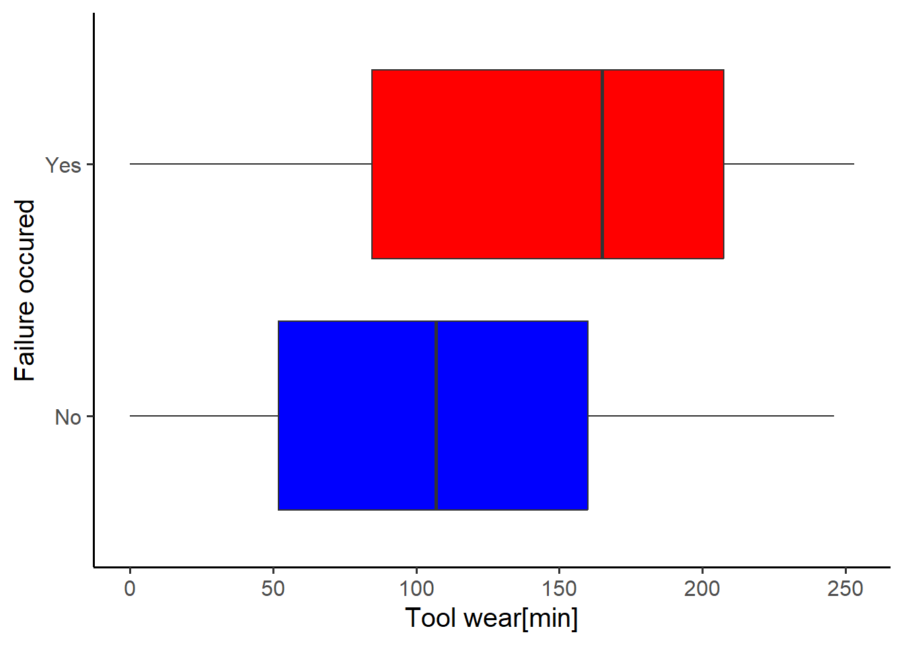
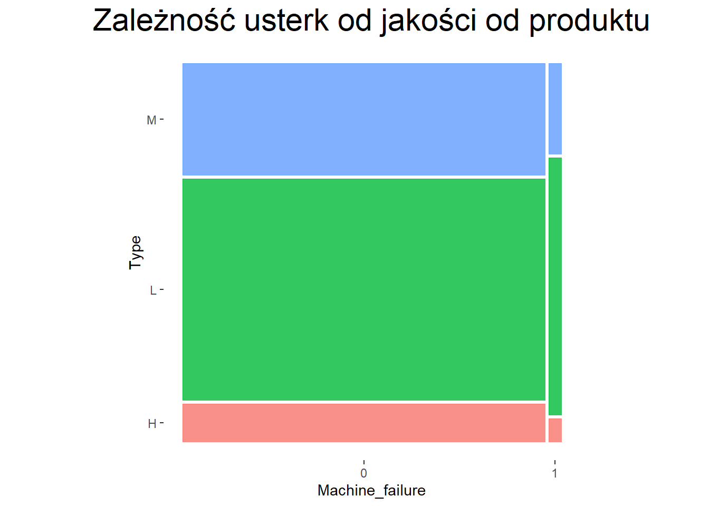
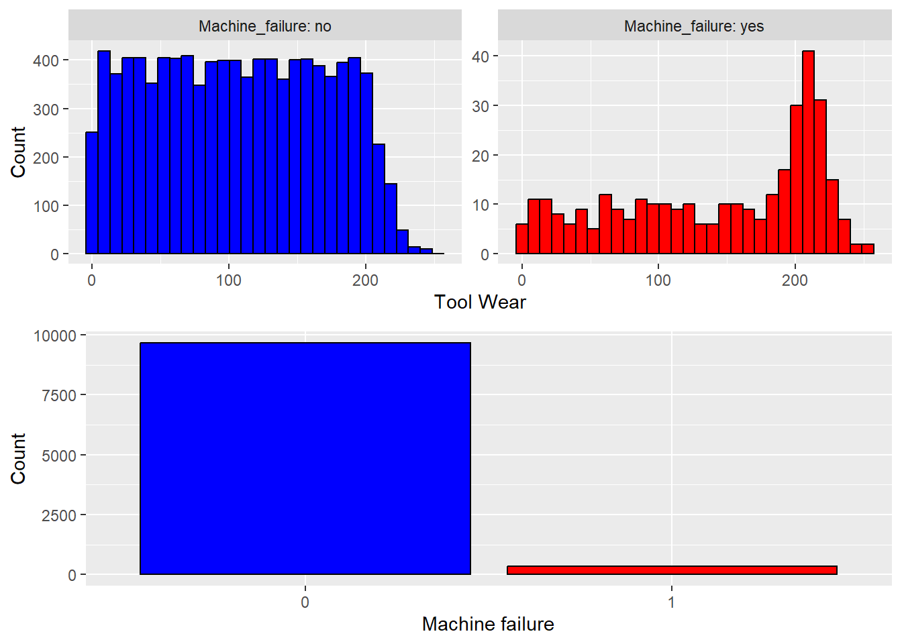

# Exploratory Data Analysis 


::: {.cell}
::: {.cell-output .cell-output-stdout}
```
[1] 24  1  0  0
```
:::
:::

::: {.cell}
::: {.cell-output-display}
{width=672}
:::

::: {.cell-output-display}
{width=672}
:::
:::

::: {.cell}
::: {.cell-output-display}
{width=672}
:::

::: {.cell-output-display}
{width=672}
:::
:::

::: {.cell}
::: {.cell-output-display}
{width=672}
:::

::: {.cell-output-display}
{width=672}
:::

::: {.cell-output-display}
{width=672}
:::
:::

::: {.cell}
::: {.cell-output-display}
{width=672}
:::
:::

