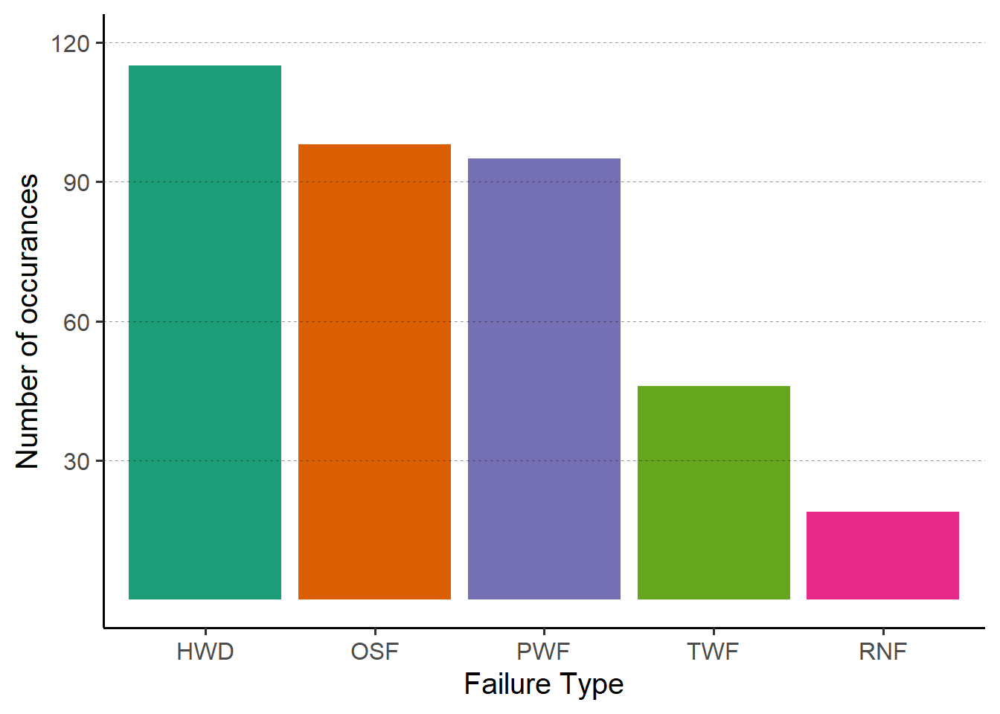

# Exploratory Data Analysis 


::: {.cell}

```{.r .cell-code}
data <- readRDS("data/eda_data.rds")
c(
nrow(data[which(data$TWF + data$HDF + data$PWF + data$OSF + data$RNF >= 2),]),
nrow(data[which(data$TWF + data$HDF + data$PWF + data$OSF + data$RNF >= 3),]),
nrow(data[which(data$TWF + data$HDF + data$PWF + data$OSF + data$RNF >= 4),]),
nrow(data[which(data$TWF + data$HDF + data$PWF + data$OSF + data$RNF >= 5),]))
```

::: {.cell-output .cell-output-stdout}
```
[1] 24  1  0  0
```
:::
:::

::: {.cell}

```{.r .cell-code}
library(tidyverse)
```

::: {.cell-output .cell-output-stderr}
```
Warning: pakiet 'tidyverse' został zbudowany w wersji R 4.2.3
```
:::

::: {.cell-output .cell-output-stderr}
```
Warning: pakiet 'ggplot2' został zbudowany w wersji R 4.2.3
```
:::

::: {.cell-output .cell-output-stderr}
```
Warning: pakiet 'tibble' został zbudowany w wersji R 4.2.3
```
:::

::: {.cell-output .cell-output-stderr}
```
Warning: pakiet 'tidyr' został zbudowany w wersji R 4.2.3
```
:::

::: {.cell-output .cell-output-stderr}
```
Warning: pakiet 'readr' został zbudowany w wersji R 4.2.3
```
:::

::: {.cell-output .cell-output-stderr}
```
Warning: pakiet 'purrr' został zbudowany w wersji R 4.2.3
```
:::

::: {.cell-output .cell-output-stderr}
```
Warning: pakiet 'dplyr' został zbudowany w wersji R 4.2.3
```
:::

::: {.cell-output .cell-output-stderr}
```
Warning: pakiet 'stringr' został zbudowany w wersji R 4.2.3
```
:::

::: {.cell-output .cell-output-stderr}
```
Warning: pakiet 'forcats' został zbudowany w wersji R 4.2.3
```
:::

::: {.cell-output .cell-output-stderr}
```
Warning: pakiet 'lubridate' został zbudowany w wersji R 4.2.3
```
:::

::: {.cell-output .cell-output-stderr}
```
── Attaching core tidyverse packages ──────────────────────── tidyverse 2.0.0 ──
✔ dplyr     1.1.1     ✔ readr     2.1.4
✔ forcats   1.0.0     ✔ stringr   1.5.0
✔ ggplot2   3.4.2     ✔ tibble    3.2.1
✔ lubridate 1.9.2     ✔ tidyr     1.3.0
✔ purrr     1.0.1     
── Conflicts ────────────────────────────────────────── tidyverse_conflicts() ──
✖ dplyr::filter() masks stats::filter()
✖ dplyr::lag()    masks stats::lag()
ℹ Use the conflicted package (<http://conflicted.r-lib.org/>) to force all conflicts to become errors
```
:::

```{.r .cell-code}
load("data/model_data.rda")

model_data %>%
  mutate(Machine_failure=ifelse(Machine_failure==1,"Yes","No")) %>%
  ggplot(aes(y=Machine_failure,x=Tool_wear,fill=Machine_failure))+
    geom_boxplot(show.legend = FALSE)+
    labs(x="Tool wear[min]", y="Failure occured")+
    scale_fill_manual(values = c("blue","red"))+
    theme_classic(base_size = 15)
```

::: {.cell-output-display}
{width=672}
:::

```{.r .cell-code}
failures <- data.frame(failure_type=c("TWF","HWD","PWF","OSF","RNF"),sum=c(sum(data$TWF),sum(data$HDF),sum(data$PWF),sum(data$OSF),sum(data$RNF)))

failures$failure_type <- as.factor(failures$failure_type)

# sum(failures$sum)-sum(as.numeric(data$Machine_failure)-1)
# 
# data[which(data$Machine_failure==0 & (data$TWF + data$HDF + data$PWF + data$OSF + data$RNF != 0)),]
# 
# data[which(data$RNF==1),]

failures %>%
  ggplot(aes(x=reorder(failure_type, -sum),y=sum,fill=failure_type))+
  geom_col()+
  geom_hline(yintercept = seq(30,120,by=30), linetype = "dashed", color = "black", alpha = 0.4, size=0.3)+
  scale_y_continuous(breaks = seq(30,120,by=30))+
  labs(x="Failure Type",y="Number of occurances")+
  scale_fill_brewer(palette = "Dark2")+
  theme_classic()
```

::: {.cell-output .cell-output-stderr}
```
Warning: Using `size` aesthetic for lines was deprecated in ggplot2 3.4.0.
ℹ Please use `linewidth` instead.
```
:::

::: {.cell-output-display}
{width=672}
:::
:::

